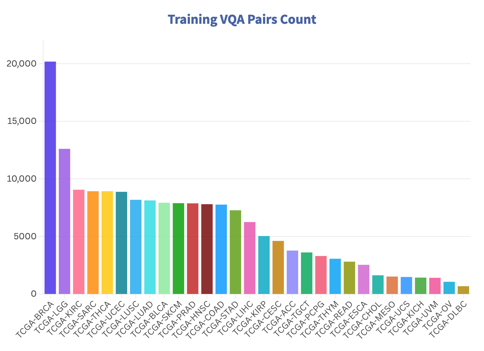

#  WSI-LLaVA: A Multimodal Large Language Model for Whole Slide Image

**WSI-LLaVA** is a multimodal large language model designed for Whole Slide Image (WSI) analysis, bridging the gap between gigapixel WSIs and textual descriptions. It introduces innovative methods and benchmarks for advancing pathology-focused AI research.

---

## 📂 Open Resources

We are committed to transparency and open science. Currently, the following resources are available:

- 📄 **[Test Dataset](./dataset/WSI-Bench_test.json)**: A subset of VQA pairs and WSI data covering 30 cancer types, including a testing set of 208 WSIs with 4,119 VQA pairs.
- 📚 **Train Dataset**: *Coming Soon*  
- 🎯 **Pre-trained Weights**: *Coming Soon*  
- 🧬 **TCGA WSI Features**: *Coming Soon*  
- 🚀 **Codebase**:  *Submitted, Updates in Progress*  

  
  

> **Note:** TCGA images included in the dataset can be downloaded from the [TCIA Portal](https://portal.imaging.datacommons.cancer.gov/explore/).

> **Note:** Additional dataset partitions and fine-tuned weights will be released in future updates.

---

## 🏗️ Architecture

WSI-LLaVA consists of three core components:
1. **WSI Encoder**: Processes gigapixel WSIs for feature extraction.
2. **Projection Layer**: Aligns WSI features with textual embeddings.
3. **Large Language Model**: Generates context-aware and clinically relevant textual responses.

The training strategy incorporates three key stages for optimal performance on gigapixel WSIs.

---

## 📊 WSI-Bench

In clinical practice, morphological features such as tissue and cellular structural abnormalities play a critical role in diagnosis. Existing models often overlook these crucial details. To address this, we propose **WSI-Bench**:

- **Scope**: 180k VQA pairs from 9,850 WSIs, spanning 30 cancer types and sourced from 8,368 patients.
- **Tasks**: 11 pathology-focused VQA tasks designed to evaluate three major pathological capabilities.

---

## 📷 Additional Visuals

### **WSI-LLaVA Key Contributions**

---

This README introduces the **WSI-LLaVA** project, highlights its key contributions, describes the architecture, and provides access to resources such as datasets. Updates for weights and training data will follow in subsequent releases. Let us know if you have any questions or feedback!