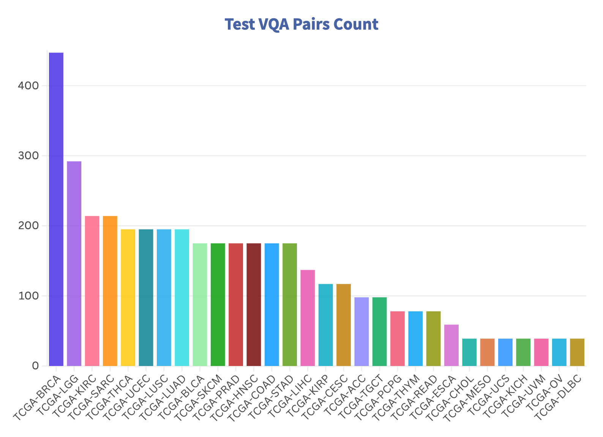
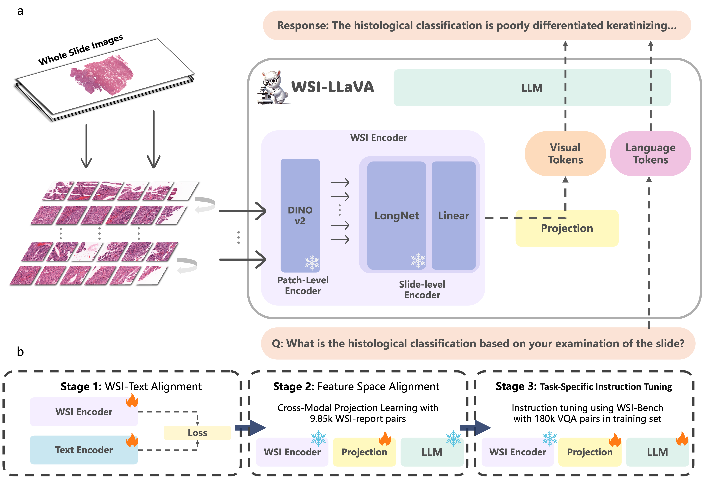
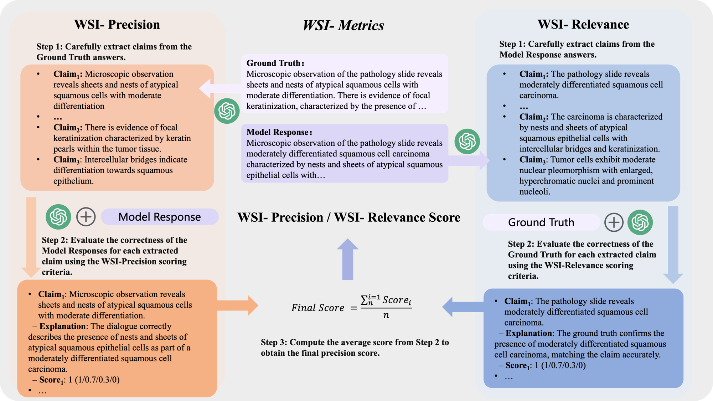

#  WSI-LLaVA: A Multimodal Large Language Model for Whole Slide Image (ICCV 2025)


<table style="border: none;">
<tr>
<td width="49%" valign="top" style="border: none;">

🏠 **[Homepage](https://wsi-llava.github.io/)** | 🤗 **[huggingface](https://huggingface.co/datasets/LyuLucas/WSI-Bench)** | 📖 **[Paper](https://arxiv.org/abs/2412.02141)**

**WSI-LLaVA** is a multimodal large language model designed for Whole Slide Image (WSI) analysis, bridging the gap between gigapixel WSIs and textual descriptions. It introduces innovative methods and benchmarks for advancing pathology-focused AI research.

</td>
<td width="49%" valign="top" style="border: none;">


</td>
</tr>
</table>


## 📂 Open Resources

We are committed to transparency and open science. Currently, the following resources are available:

- 📄 **[Test Dataset](./dataset/)**: A subset of VQA pairs and WSI data covering 30 cancer types, including a testing set of 208 WSIs with 4,119 VQA pairs.
- 📚 **[Train Dataset](./dataset/)**: A comprehensive collection of VQA pairs and WSI data covering 30 cancer types, including 9,642 WSIs with 175,450 VQA pairs. Now publicly available！
- 🎯 **Pre-trained Weights**: *Coming Soon*  
- 🧬 **TCGA WSI Features**: *Coming Soon*  
- 🚀 **Code**:  *Submitted, Updates in Progress*  

<p align="center">
  
  
</p>

> **Note:** TCGA images included in the dataset can be downloaded from the [TCIA Portal](https://portal.imaging.datacommons.cancer.gov/explore/).

> **Note:** Additional dataset partitions and fine-tuned weights will be released in future updates.

---


## 🚀 Usage

### Step 1: Slide Feature Extraction Modification

#### Base Repository
Based on [prov-gigapath](https://github.com/prov-gigapath/prov-gigapath/tree/main). This is the slide encoder part for feature extraction in our model.

#### Modified File
`gigapath/slide_encoder.py`

#### Change Description

Modified the global pooling section in the `forward` method of `LongNetViT` class:

**Before:**
```python
if self.global_pool:
    x = x[:, 1:, :].mean(dim=1)  # global average pooling
    outcome = self.norm(x)
```

**After:**
```python
if self.global_pool:
    x = x[:, 1:, :]
    x = torch.nn.functional.adaptive_avg_pool1d(x.permute(0, 2, 1), 576).permute(0, 2, 1)
    # Pad from (576, 768) to (576, 1024)
    x = torch.nn.functional.pad(x, (0, 256), mode='constant', value=0)
    outcome = self.norm(x)
```

Replaced global average pooling with `adaptive_avg_pool1d` to compress sequence length to a fixed 576 tokens. The output dimension is (576, 768), which is then padded with zeros to (576, 1024) for downstream processing.


## 🏗️ Architecture

WSI-LLaVA consists of three core components:
1. **WSI Encoder**: Processes gigapixel WSIs for feature extraction.
2. **Projection Layer**: Aligns WSI features with textual embeddings.
3. **Large Language Model**: Generates context-aware and clinically relevant textual responses.

The training strategy incorporates three key stages for optimal performance on gigapixel WSIs.



---

## 📊 WSI-Bench

In clinical practice, morphological features such as tissue and cellular structural abnormalities play a critical role in diagnosis. Existing models often overlook these crucial details. To address this, we propose **WSI-Bench**:

- **Scope**: 180k VQA pairs from 9,850 WSIs, spanning 30 cancer types and sourced from 8,368 patients.
- **Tasks**: 11 pathology-focused VQA tasks designed to evaluate three major pathological capabilities.


---

## 📏 WSI-Metrics

Traditional NLU metrics like BLEU and ROUGE cannot accurately assess pathology performance due to complex medical terminology. We introduce two specialized metrics:

- **WSI-Precision**: Measures accuracy of model responses against ground-truth claims
- **WSI-Relevance**: Measures alignment of model responses with clinical relevance

These domain-specific metrics provide more clinically relevant assessment than traditional NLU metrics, with strong correlation to expert evaluations.



---
